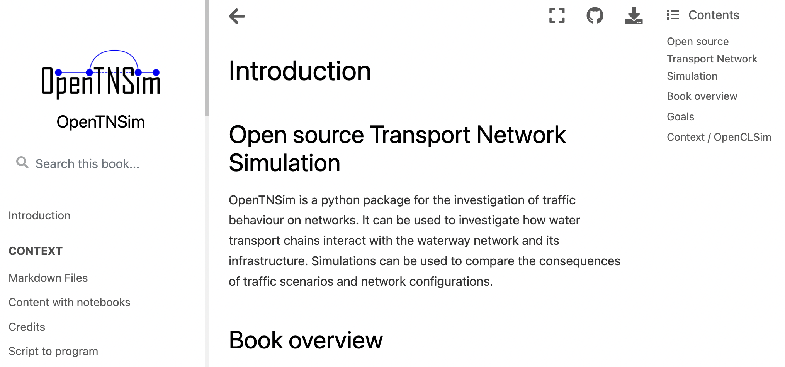

[](https://opentnsim.readthedocs.io/)
[](https://github.com/TUDelft-CITG/Transport-Network-Analysis/blob/master/LICENSE.txt)
[](https://zenodo.org/badge/latestdoi/145843547)

[](https://dl.circleci.com/status-badge/redirect/gh/TUDelft-CITG/OpenTNSim/tree/master)

# OpenTNSim

**Open** source **T**ransport **N**etwork **Sim**ulation -  Analysis of traffic behaviour on networks for different traffic scenarios and network configurations.

Documentation can be found: [here](https://opentnsim.readthedocs.io/)

## Book

<a href="https://happy-bush-0c5d10603.1.azurestaticapps.net"></a>

You can find the opentnsim book, based on the examples in the `notebooks` folder on the [opentnsim-book](https://happy-bush-0c5d10603.1.azurestaticapps.net/) website.


## Installation

### Quick Start (5 minutes)

**Prerequisites:**
- Python 3.12 or higher
- pip
- Dependency manager; Poetry or UV (see guides below)

If you do not have [pip](https://pip.pypa.io) installed, this [Python installation guide](http://docs.python-guide.org/en/latest/starting/installation/) can guide you through the process. You can read the [documentation](https://opentnsim.readthedocs.io/en/latest/installation.html) for other installation methods and a more detailed description.

**Step 1: Install Poetry**

Poetry is a dependency manager that automatically handles virtual environments and packages.

For detailed instructions, see the [official Poetry installation guide](https://python-poetry.org/docs/#installing-with-the-official-installer).

**Windows (PowerShell):**
```powershell
(Invoke-WebRequest -Uri https://install.python-poetry.org -UseBasicParsing).Content | py -
```

**Linux/Mac:**
```bash
curl -sSL https://install.python-poetry.org | python3 -
echo 'export PATH="$HOME/.local/bin:$PATH"' >> ~/.bashrc
source ~/.bashrc
```

**Verify (Linux/Mac/Windows):** `poetry --version` should show version 2.0.0 or higher.
```bash
Poetry (version 2.2.1)
```

**Upgrade poetry itself**
If it does not show poetry version 2 or higher then update poetry with:
```bash
poetry self update
```

**Step 2: Get OpenTNSim**

```bash
# Clone the repository
git clone https://github.com/TUDelft-CITG/OpenTNSim.git
cd OpenTNSim

# Install all dependencies (may take some time)
poetry install
```

Finsihed. Poetry automatically creates a virtual environment and installs all packages.

**Step 3: Verify Installation**

```bash
# Check packages are installed
poetry show

# Test OpenTNSim works
poetry run python -c "import opentnsim; print('opentnsim.__version__')"
```

### Using OpenTNSim

You have two options for running Python code:

**Option A: Use `poetry run` (Recommended)**
```bash
poetry run python your_script.py
poetry run pytest
poetry run jupyter notebook
```

**Option B: Activate Poetry environment**
1. 
```bash
# Activate environment
poetry env activate
```
2. copy the output in your terminal
`source /home/your_linux_user_name/OpenTNSim/.venv/bin/activate`

3. Now you can run commands normally
```bash
python your_script.py
pytest
```
### Working with Jupyter Notebooks
**Recommended: Usage in VS Code:**
1. Check if Jupyter extension is installed with poetry `show ipykernel`.
2. Open any `.ipynb` file
3. Select "opentnsim" kernel. Should look something like: `opentnsim-py3.13`.

**Jupyter Server in Browser**
```bash
# Install Jupyter kernel (one-time setup)
poetry run python -m ipykernel install --user --name=opentnsim

# Start Jupyter
poetry run jupyter notebook
```
1. Terminal shows a link to jupyter server: example [http://localhost:8888/tree?token=the_generated_token](https://)
2. Will take you to your browser, select notebook and kernel: 'opentnsim'
3. Run the notebooks 


### Common Commands

| Task | Command |
|------|---------|
| Install dependencies | `poetry install` |
| Add a package | `poetry add package-name` |
| Remove a package | `poetry remove package-name` |
| Update packages | `poetry update` |
| List packages | `poetry show` |
| Run Python script | `poetry run script.py` |
| Run tests | `poetry run pytest` |
| Activate environment | `poetry env activate` |


### Installing from PyPI (End Users)

If you just want to use OpenTNSim without development:

```bash
pip install opentnsim
```

**Note:** The Poetry method above is recommended for development and running notebooks.

## Testing
All test commands use `poetry run` to ensure correct environment:

```bash
# Run all unit tests
poetry run pytest

# Run notebook tests
poetry run pytest --nbmake ./notebooks --nbmake-kernel=python3 --ignore ./notebooks/cleanup --ignore ./notebooks/student_notebooks --ignore ./notebooks/broken

# Run specific test
poetry run pytest -k test_graph

# Run with coverage
poetry run pytest --cov=opentnsim
```

If you activated the environment with `poetry env activate`, it is not necessary to run `poetry run`:
```bash
poetry env activate
pytest
pytest -k test_graph
```

## Troubleshooting

### "poetry: command not found"

**Windows:** Add Poetry to PATH and restart terminal. Check `C:\Users\YourName\AppData\Roaming\Python\Scripts` exists and is in PATH.

**Linux/Mac:** Run `export PATH="$HOME/.local/bin:$PATH"` and add to `~/.bashrc` permanently.

### "No module named 'opentnsim'"

Make sure you:
1. Installed dependencies: `poetry install`
2. Use `poetry run` before Python commands, or activate with `poetry env activate`

### Tests fail or packages missing

```bash
# Reinstall dependencies
poetry install

# If lock file has issues
poetry lock --no-update

# then reinstall again
poetry install
```

### Wrong Python version

```bash
# Check current version
poetry env info

# Check available python versions
pyenv versions

# Use specific Python version
poetry env use python3.12
poetry env use python3.13

# Reinstall
poetry install
```

### Can't select "opentnsim" kernel in Jupyter

```bash
# Reinstall kernel
poetry run python -m ipykernel install --user --name=opentnsim --display-name "OpenTNSim"

# Restart Jupyter
```

## Managing Dependencies

### Adding Packages

```bash
# Add production dependency
poetry add package-name

# Add development dependency
poetry add --group dev package-name

# Example: Add with version constraint
poetry add "requests>=2.28.0"
```

### Removing Packages

```bash
poetry remove package-name
poetry remove --group dev package-name
```

### Updating Packages

```bash
# Update all packages
poetry update

# Update specific package
poetry update package-name

# Show outdated packages
poetry show --outdated
```

## Understanding Poetry Files

**`pyproject.toml`** - Lists all dependencies and project configuration. Edit using `poetry add/remove` commands.

**`poetry.lock`** - Contains exact versions of all packages. Never edit manually.

**`.venv/`** - Virtual environment folder. Never commit to Git (in `.gitignore`).

## FAQ

**Q: Should I use Poetry or pip?**  
A: Use Poetry for development and notebooks. It handles environments automatically and ensures everyone has the same package versions.

**Q: Do I need to activate a virtual environment?**  
A: Not necessarily. There are two options:
1. Poetry handles this automatically when you use `poetry run`. 
2. Or use `poetry env activate` & paste the output in your terminal to activate it explicitly
For Linux: `source /home/your_linux_user_name/OpenTNSim/.venv/bin/activate`
For Windows


**Q: Can I still use pip?**  
A: Not recommended during development. Use `poetry add` instead. For end users, `pip install opentnsim` still works.

**Q: Where are my packages installed?**  
A: Poetry creates a virtual environment. Check location with `poetry env info`.

**Q: How do I share my environment with teammates?**  
A: Commit `pyproject.toml`. Teammates/Students can run `poetry install` to get same versions and dependencies

**Q: How do I reset everything?**  
A: Delete the environment and reinstall:
```bash
poetry env remove
poetry install
```

## Examples

The benefit of OpenTNSim is the generic set-up. A number of examples are presented in in the `notebooks` folder on the [opentnsim-book](https://happy-bush-0c5d10603.1.azurestaticapps.net/) website. Additional examples can be found in the notebooks-folder in this repository. 

## Book

Based on the examples and docs a book can be generated using the commands `make book` and cleaned up using `make clean-book`. These commands are unix only.

## Code quality
Code quality is checked using sonarcloud. You can see results on the [sonarcloud](https://sonarcloud.io/project/overview?id=TUDelft-CITG_OpenTNSim) website. For now we have disabled coverage and duplication checks. These can be enabled when we include coverage measurements and reduce duplication by optimizing the tests.


## OpenCLSim 
OpenTNSim makes use of the [OpenCLSim](https://github.com/TUDelft-CITG/OpenCLSim) code. Both packages are maintained by the same team of developers. You can use these packages together, and combine mixins from both packages. When you experience a problem with integrating the two packages, please let us know. We are working towards further integrating these two software packages.
