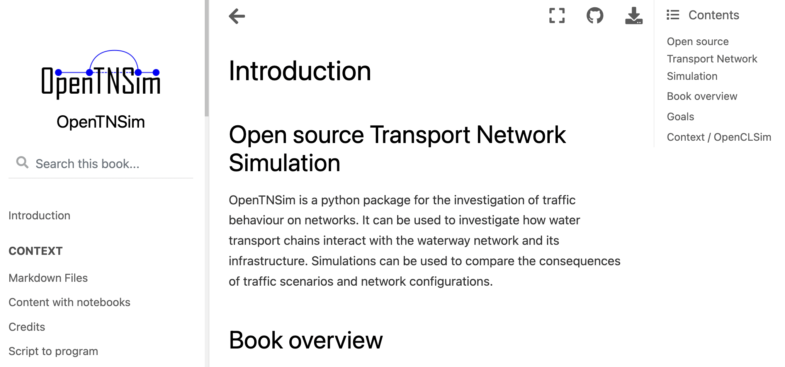

[](https://opentnsim.readthedocs.io/)
[](https://github.com/TUDelft-CITG/Transport-Network-Analysis/blob/master/LICENSE.txt)
[](https://zenodo.org/badge/latestdoi/145843547)

[](https://circleci.com/gh/TUDelft-CITG/OpenTNSim)
[](https://artifact-getter.herokuapp.com/get_coverage_report?circle_url=https://circleci.com/gh/TUDelft-CITG/OpenTNSim&circle_token=727b95b70301407d3c0af44e1af2039fd9486f6f)

# OpenTNSim

**Open** source **T**ransport **N**etwork **Sim**ulation -  Analysis of traffic behaviour on networks for different traffic scenarios and network configurations.

Documentation can be found: [here](https://opentnsim.readthedocs.io/)

## Book

<a href="https://happy-bush-0c5d10603.1.azurestaticapps.net"></a>

You can find the opentnsim book, based on the examples in the `notebooks` folder on the [opentnsim-book](https://happy-bush-0c5d10603.1.azurestaticapps.net/) website.


## Installation

To install OpenTNSim, run this command in your terminal:

``` bash
pip install opentnsim
```

To also install the extra dependencies used for testing you can use:
``` bash
pip install opentnsim[testing]
```

This is the preferred method to install OpenTNSim, as it will always install the most recent stable release.

If you don not have [pip](https://pip.pypa.io) installed, this [Python installation guide](http://docs.python-guide.org/en/latest/starting/installation/) can guide you through the process.

You can read the [documentation](https://opentnsim.readthedocs.io/en/latest/installation.html) for other installation methods.


## Testing
You can run the unit tests

```bash
pytest
```

Or you can run the notebook tests:
```bash
pytest --nbmake ./notebooks --nbmake-kernel=python3 --ignore ./notebooks/cleanup ./notebooks/students
```

Or you can run a specific test like this:

``` bash
pytest -k test_single_engine
```

`


## Examples

The benefit of OpenTNSim is the generic set-up. A number of examples are presented in a seperate [Jupyter Notebook repository](https://github.com/TUDelft-CITG/OpenTNSim-Notebooks). Information on how to use the notebooks is presented in that repository as well.

## Book

Based on the examples and docs a book can be generated using the commands `make book` and cleaned up using `make clean-book`. These commands are unix only.

## Code quality
Code quality is checked using sonarcloud. You can see results on the [sonarcloud](https://sonarcloud.io/project/overview?id=TUDelft-CITG_OpenTNSim) website. For now we have disabled coverage and duplication checks. These can be enabled when we include coverage measurements and reduce duplication by optimizing the tests.


## OpenCLSim 
OpenTNSim makes use of the [OpenCLSim](https://github.com/TUDelft-CITG/OpenCLSim) code. Both packages are maintained by the same team of developers. There are some differences between packages (e.g. in logging approaches), but you can use them together. We are working towards further integrating these two software packages.
