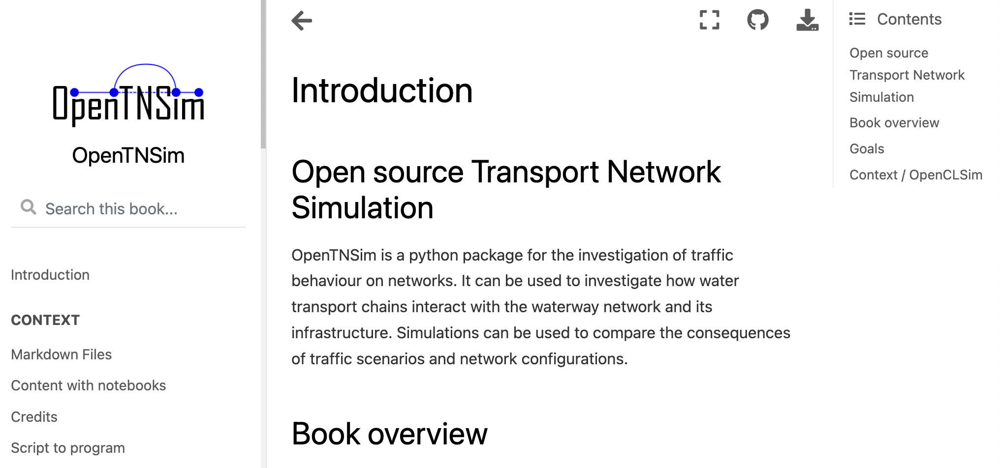

Open source Transport Network Simulation
========================================

OpenTNSim is a python package for the investigation of traffic behaviour on networks to compare the consequences of different traffic scenarios and network configurations.

Welcome to OpenTNSim documentation! Please check the contents below for information on installation, getting started and actual example code. If you want to dive straight into the code you can check out our `GitHub`_ page or the working examples presented in `Jupyter Notebooks`_. The examples in the notebooks directory are also available as an online book.

.. toctree::
   :maxdepth: 1
   :caption: Contents:

   installation
   opentnsim
   contributing
   authors
   history
   version-conventions

Indices and tables
==================

* :ref:`genindex`
* :ref:`modindex`
* :ref:`search`

.. _GitHub: https://github.com/TUDelft-CITG/OpenTNSim
.. _Jupyter Notebooks: https://github.com/TUDelft-CITG/OpenTNSim/notebooks
